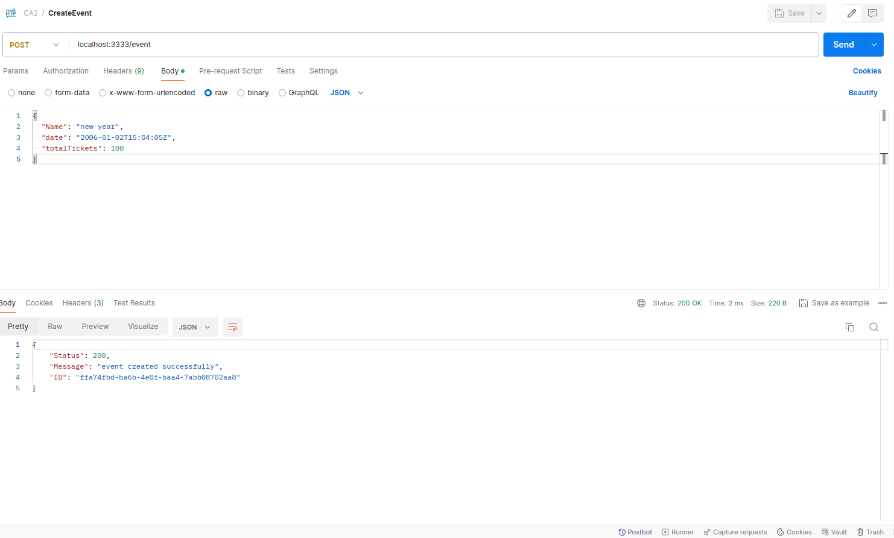
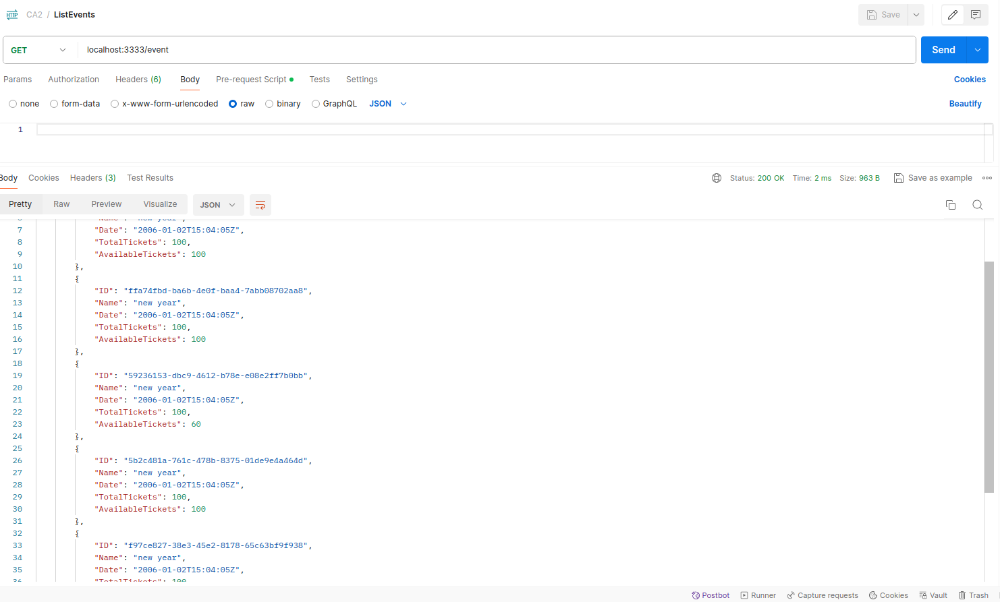
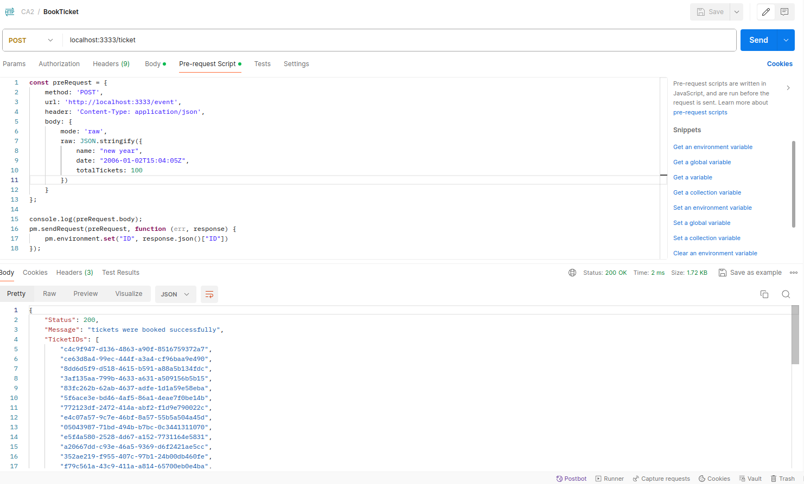

# پروژه دوم درس رایانش توزیع شده

## فهرست

- [پروژه دوم درس رایانش توزیع شده](#پروژه-دوم-درس-رایانش-توزیع-شده)
  - [فهرست](#فهرست)
  - [تکمیل کد ها](#تکمیل-کد-ها)
  - [Caching](#caching)
  - [پیاده سازی API](#پیاده-سازی-api)
    - [RequestImp.go](#requestimpgo)
    - [ResponseImp.go](#responseimpgo)
    - [مثالی از یک Request](#مثالی-از-یک-request)
    - [main.go](#maingo)
  - [Fairness](#fairness)
  - [خلاصه ای از Life Cycle هر Request](#خلاصه-ای-از-life-cycle-هر-request)
  - [نتایج](#نتایج)
    - [ایجاد یک رویداد](#ایجاد-یک-رویداد)
    - [لیست کردن رویداد ها](#لیست-کردن-رویداد-ها)
    - [رزرو بلیت برای رویداد ها](#رزرو-بلیت-برای-رویداد-ها)
    - [تست Fairness](#تست-fairness)
  - [اعضای گروه](#اعضای-گروه)
  - [Github Repository](#github-repository)

## تکمیل کد ها

ابتدا فایل های
Ticket.go,
Entity.go و TicketService.go
را به پروژه اضافه میکنیم و TicketService.go
را به گونه ای تغییر می دهیم که consistency
مورد خطر قرار ندهد.

```go
...
var generateUUID = func() string {
 return uuid.New().String()
}

type TicketService struct {
 events  sync.Map
 tickets sync.Map

 eventsCache *Cache
}

func NewTicketService() *TicketService {
 return &TicketService{
  eventsCache: NewCache(),
 }
}

func (ts *TicketService) CreateEvent(name string, date time.Time, totalTickets int) (*Event, error) {
 log.Println("CreateEvent called")
 event := &Event{
  ID:               generateUUID(),
  Name:             name,
  Date:             date,
  TotalTickets:     totalTickets,
  AvailableTickets: totalTickets,
 }

 ts.storeEvent(event.ID, event)
 log.Printf("Event with id = %s were created", event.ID)
 return event, nil
}

func (ts *TicketService) ListEvents() []*Event {
 log.Println("ListEvents called")
 var events []*Event
 ts.events.Range(func(key, value interface{}) bool {
  event := value.(*Event)
  events = append(events, event)
  return true
 })
 return events
}

func (ts *TicketService) BookTickets(eventID string, numTickets int) ([]string, error) {
 log.Println("Book Tickets called")
 event, ok := ts.loadEvent(eventID)
 if !ok {
  return nil, fmt.Errorf("event not found")
 }

 var ev *Event
 if ev, ok = event.(*Event); !ok {
  return nil, fmt.Errorf("invalid event")
 }

 log.Printf("Event found: name=%s , id=%s , available tickets=%d", ev.Name, ev.ID, ev.AvailableTickets)

 if ev.AvailableTickets < numTickets {
  return nil, fmt.Errorf("not enough tickets available")
 }

 var ticketIDs []string
 for i := 0; i < numTickets; i++ {
  ticket := &Ticket{
   ID:      generateUUID(),
   EventID: ev.ID,
  }
  ticketIDs = append(ticketIDs, ticket.ID)
  ts.tickets.Store(ticket.ID, ticket)
 }

 ev.mu.Lock()
 ev.AvailableTickets -= numTickets
 ev.mu.Unlock()

 ts.storeEvent(eventID, ev)

 log.Printf("%d tickets were added", len(ticketIDs))

 return ticketIDs, nil
}

func (ts *TicketService) loadEvent(id string) (any, bool) {
 value, ok := ts.eventsCache.Load(id)
 if !ok {
  value, ok := ts.events.Load(id)
  if !ok {
   return nil, false
  }
  ts.eventsCache.Cache(id, value)
  return value, true
 } else {
  return value, true
 }
}

func (ts *TicketService) storeEvent(id string, value any) {
 ts.events.Store(id, value)
 ts.eventsCache.Cache(id, value)
}

```

## Caching

برای قسمت cache
کردن Event
ها، یک struct
مانند زیر می نویسیم که کار آن پیاده سازی رفتار این cache
است. سیاست جانشینی این cache
ابتدا خالی بودن آن خانه از cache،
و سپس قدیمی بود آن است.

```go
type entry struct {
 value any
 id    string
 time  time.Time
 valid bool

 mu sync.Mutex
}

type Cache struct {
 entries [cacheSize]*entry
}

func NewCache() *Cache {
 entries := [cacheSize]*entry{}
 for i := range entries {
  entries[i] = &entry{
   valid: false,
  }
 }

 return &Cache{
  entries: entries,
 }
}

func (c *Cache) Cache(id string, value any) {
 firstInvalid := -1
 lastOneCalled := -1
 oldestTime := time.Time{}
 timeNotSet := true
 for i := 0; i < cacheSize; i++ {
  entry := c.entries[i]
  if !entry.valid {
   if firstInvalid == -1 {
    firstInvalid = i
   }
   continue
  }
  if timeNotSet || entry.time.Before(oldestTime) {
   lastOneCalled = i
   oldestTime = entry.time
   timeNotSet = false
  }

  if entry.id == id {
   entry.mu.Lock()
   entry.value = value
   entry.time = time.Now()
   entry.valid = true
   entry.mu.Unlock()
   return
  }
 }
 var entry *entry
 if firstInvalid != -1 {
  entry = c.entries[firstInvalid]
 } else {
  entry = c.entries[lastOneCalled]
 }
 entry.mu.Lock()
 entry.value = value
 entry.time = time.Now()
 entry.valid = true
 entry.mu.Unlock()
}

func (c *Cache) Load(id string) (any, bool) {
 for i := 0; i < cacheSize; i++ {
  entry := c.entries[i]
  if !entry.valid {
   continue
  }
  if entry.id == id {
   entry.mu.Lock()
   entry.time = time.Now()
   entry.mu.Unlock()
   return entry.value, true
  }
 }
 return nil, false
}

```

## پیاده سازی API

تصمیم گرفتیم خروجی این تمرین را به صورت یک Rest API
با کمک فریمورک gin
ارائه دهیم. اما به منظور در نظر گرفتن خواسته ی مساله مبنی بر استفاده ی دستی از goroutine
ها،‌ تصمیم بر آن شد که با اضافه کردن یک لایه پیاده سازی Request Handling
را خود انجام دهیم.
در نتیجه فایل main.go
به شکل ساده ای در آمد که route
ها را به متد Exec()
ریکوئست ها map
می کرد. ( برای هر دوی ریکوئست ها و ریسپانس ها،‌ interface
هایی طراحی شد که بتوانند abstraction را برای ما به ارمغان آورند)

### RequestImp.go

```go
type RequestImp interface {
 Exec(ts *TicketService) ResponseImp
 GetContext() *gin.Context
 GetWaitGroup() *sync.WaitGroup
}
```

### ResponseImp.go

```go
type ResponseImp interface {
 GetStatus() int
}
```

### مثالی از یک Request

حال برای مثال می توانیم کد مربوط به CreateEventRequest را نمایش دهیم که این abstraction
را پیاده سازی میکند:

```go
type CreateEventRequest struct {
 tictserv.RequestImp \`json:"-"\`
 ContextHolder       \`json:"-"\`
 Name                string
 Date                time.Time
 TotalTickets        int
}

func (rq *CreateEventRequest) Exec(ts *tictserv.TicketService) tictserv.ResponseImp {
 if event, err := ts.CreateEvent(rq.Name, rq.Date, rq.TotalTickets); err != nil {
  return &responses.ErrorResponse{
   Status:  500,
   Message: "create event failed: " + err.Error(),
  }
 } else {
  return &responses.CreateEventResponse{
   Status:  200,
   ID:      event.ID,
   Message: "event created successfully",
  }
 }
}

func (rq *CreateEventRequest) GetContext()*gin.Context {
 return rq.ContextHolder.Context
}

func (rq *CreateEventRequest) GetWaitGroup()*sync.WaitGroup {
 return rq.ContextHolder.WaitGroup
}
```

### main.go

تابع main،
همان طور که گفته شد، وظیفه ی map
کردن route
های مورد استفاده ی REST API
به handler
مخصوص خود را بر عهده دارد. همچنین در همین جاست که از `gin.Engine`
یک instance گرفته می شود.

```go
func main() {
 address := ":" + strconv.Itoa(ServerPort)
 service := tictserv.NewTicketService()
 rqch = make(chan tictserv.RequestImp)
 fp = tictserv.NewFairnessProvider(MaxAcceptedRequestsPerHost)

 go tictserv.HandleRequest(service, rqch)

 r := gin.Default()

 config := cors.DefaultConfig()
 config.AllowOrigins = []string{"*"}
 r.Use(cors.New(config))

 r.GET("/", handleGetRoot)
 r.POST("/event", handlePostEvent)
 r.GET("/event", handleGetEvent)
 r.POST("/ticket", handlePostTicket)

 wg := &sync.WaitGroup{}
 wg.Add(1)
 go func() {
  defer wg.Done()
  if err := r.Run(address); err != nil {
   return
  }
 }()

 log.Printf("Server is starting on port %d", ServerPort)
 wg.Wait()
 close(rqch)

}
```

فرمت این handler ها به صورت زیر است:

```go
func handlePostEvent(ctx *gin.Context) {
 handle(ctx, func() {
  wg := &sync.WaitGroup{}
  defer wg.Wait()
  createReq := requests.CreateEventRequest{
   ContextHolder: requests.ContextHolder{
    Context:   ctx,
    WaitGroup: wg,
   },
  }

  if err := ctx.ShouldBind(&createReq); err != nil {
   if err2 := ctx.Error(err); err2 != nil {
    log.Printf("Bind error could not be sent back to the client")
   }
   ctx.AbortWithStatus(http.StatusBadRequest)
  } else {
   wg.Add(1)
   rqch <- &createReq
  }
 })
}
```

همان طور که مشاهده می شود، این handler در واقع یک تابع است که به تابع handle پاس داده می شود و این موضوع باعث می شود که فانکشنالتی آن در داخل handle به گونه ای wrap شود.
در تابع handle ما مسائل مربوط به fairness را برطرف میکنیم.
fp مخفف `FairnessProvider` است.

```go
func handle(ctx *gin.Context, fn func()) {
 if !fp.Acquire(ctx) {
  log.Printf("blocked")
  ctx.AbortWithStatus(http.StatusForbidden)
  return
 }
 fn()
 if !fp.Release(ctx) {
  log.Fatalf("cannot be released")
  return
 }
}
```

## Fairness

برای پیاده سازی fairness
از دو struct
استفاده کردیم:

اول همین `FairnessProvider`
 است که از یک جدول از semaphore
 ها تشکیل شده است.
این semaphore
 ها تنها زمانی اجازه ی دسترسی به یک هاست می دهند که تعداد request
  های فعال وی بر حسب IP address
   و port
   ش کمتر از تعداد مشخصی باشد.

   دومین struct
   همین `Semaphore` ها هستند.

پیاده سازی هر دوی این struct های مهم در پایین آمده است.

```go
type FairnessProvider struct {
 table       sync.Map
 maxAccepted int
}

func NewFairnessProvider(maxAccepted int) *FairnessProvider {
 return &FairnessProvider{
  table:       sync.Map{},
  maxAccepted: maxAccepted,
 }
}

func (fp *FairnessProvider) Acquire(ctx *gin.Context) bool {
 host := ctx.Request.Host
 entry, ok := fp.table.Load(host)
 var sem *Semaphore
 if !ok {
  sem = NewSemaphore(fp.maxAccepted)
  log.Printf("Fairness: new entry added")
 } else {
  sem = entry.(*Semaphore)
 }
 err := sem.Acquire()
 fp.table.Store(host, sem)
 if err != nil {
  log.Printf("Fairness: entry couldn't be acquired")
  return false
 } else {
  log.Printf("Fairness: entry acquired")
  return true
 }
}

func (fp *FairnessProvider) Release(ctx *gin.Context) bool {
 host := ctx.Request.Host
 entry, ok := fp.table.Load(host)
 var sem *Semaphore
 if !ok {
  log.Printf("Fairness: no entry to release")
 }
 sem = entry.(*Semaphore)
 err := sem.Release()
 if sem.IsEmpty() {
  log.Printf("Fairness: entry dropped")
 } else {
  fp.table.Store(host, sem)
 }
 if err != nil {
  log.Printf("Fairness: entry couldn't be released")
  return false
 } else {
  log.Printf("Fairness: entry released")
  return true
 }
}
```

```go
type Semaphore struct {
 count int
 max   int
 lock  sync.Mutex
}

func NewSemaphore(max int) *Semaphore {
 return &Semaphore{
  count: 0,
  max:   max,
 }
}

func (sem *Semaphore) Acquire() error {
 if sem.count < sem.max {
  sem.lock.Lock()
  sem.count += 1
  sem.lock.Unlock()
  return nil
 } else {
  return errors.New("semaphore is full")
 }
}

func (sem *Semaphore) Release() error {
 if sem.count > 0 {
  sem.lock.Lock()
  sem.count -= 1
  sem.lock.Unlock()
  return nil
 } else {
  return errors.New("semaphore is empty")
 }
}

func (sem *Semaphore) IsEmpty() bool {
 return sem.count == 0
}

```

## خلاصه ای از Life Cycle هر Request

هر request
ابتدا با استفاده از فریمورک gin
خوانده میشود و داده ها آن به تایپ درستشان تبدیل میشوند.

سپس این ریکوئست ها وارد یک channel
میشوند که بتواند برای ما concurrency  را به ارمغان آورد.

تابع `HandleRequest` این ریکوئست ها را از رو channel خوانده و متد `Exec` آن ها را فراخوانی میکند. پس آن نیز با توجه به ذخیره شدن Context در struct ریکوئست، response را نیز ارسال میکند.

```go
func HandleRequest(ts *TicketService, rqch <-chan RequestImp) {
 for req := range rqch {
  req := req
  go func() {
   res := req.Exec(ts)
   ctx := req.GetContext()
   wg := req.GetWaitGroup()

   ctx.JSON(res.GetStatus(), res)
   wg.Done()
  }()
 }
}
```

در داخل هر کدام از متد های Exec است که ارتباط با TicketService تعبیه شده است که domain provider مسئله ی ماست.

## نتایج

رابط کاربری مورد استفاده در این پروژه رابط کاربری postman بوده است که دلیل انتخاب آن سادگی interface آن است.

### ایجاد یک رویداد



### لیست کردن رویداد ها



### رزرو بلیت برای رویداد ها



### تست Fairness

برای این منظور یک سرویسی طراحی شد که به صورت زیر کار می کرد:

```go
func handleGetRoot(ctx *gin.Context) {
 handle(ctx, func() {
  ctx.JSON(200, gin.H{
   "message": "Hello World!",
  })
  time.Sleep(5 * time.Second) // 5 seconds for delay for testing fairness
 })
}
```

با کمک این تاخیر میتوانیم fairness سیستم را چک کنیم.
این نتیجه ی ۱۶ بار درخواست GET به '/' است:

```log
 Listening and serving HTTP on :3333
2024/05/03 23:16:15 Fairness: new entry added
2024/05/03 23:16:15 Fairness: entry acquired
2024/05/03 23:16:15 Fairness: entry acquired
2024/05/03 23:16:16 Fairness: entry acquired
2024/05/03 23:16:16 Fairness: entry acquired
2024/05/03 23:16:16 Fairness: entry acquired
2024/05/03 23:16:17 Fairness: entry acquired
2024/05/03 23:16:17 Fairness: entry acquired
2024/05/03 23:16:17 Fairness: entry acquired
2024/05/03 23:16:18 Fairness: entry acquired
2024/05/03 23:16:18 Fairness: entry acquired
2024/05/03 23:16:19 Fairness: entry couldn't be acquired
2024/05/03 23:16:19 blocked
[GIN] 2024/05/03 - 23:16:19 | 403 |      77.971µs |             ::1 | GET      "/"
2024/05/03 23:16:19 Fairness: entry couldn't be acquired
2024/05/03 23:16:19 blocked
[GIN] 2024/05/03 - 23:16:19 | 403 |      33.314µs |             ::1 | GET      "/"
2024/05/03 23:16:19 Fairness: entry couldn't be acquired
2024/05/03 23:16:19 blocked
[GIN] 2024/05/03 - 23:16:19 | 403 |       29.89µs |             ::1 | GET      "/"
2024/05/03 23:16:20 Fairness: entry couldn't be acquired
2024/05/03 23:16:20 blocked
[GIN] 2024/05/03 - 23:16:20 | 403 |      25.588µs |             ::1 | GET      "/"
2024/05/03 23:16:20 Fairness: entry released
[GIN] 2024/05/03 - 23:16:20 | 200 |  5.000377251s |             ::1 | GET      "/"
2024/05/03 23:16:20 Fairness: entry acquired
2024/05/03 23:16:20 Fairness: entry released
[GIN] 2024/05/03 - 23:16:20 | 200 |  5.000638862s |             ::1 | GET      "/"
2024/05/03 23:16:20 Fairness: entry acquired
2024/05/03 23:16:21 Fairness: entry released
[GIN] 2024/05/03 - 23:16:21 | 200 |  5.000591356s |             ::1 | GET      "/"
2024/05/03 23:16:21 Fairness: entry released
[GIN] 2024/05/03 - 23:16:21 | 200 |  5.001043266s |             ::1 | GET      "/"
2024/05/03 23:16:21 Fairness: entry released
[GIN] 2024/05/03 - 23:16:21 | 200 |  5.000466902s |             ::1 | GET      "/"
2024/05/03 23:16:22 Fairness: entry released
[GIN] 2024/05/03 - 23:16:22 | 200 |  5.000753453s |             ::1 | GET      "/"
2024/05/03 23:16:22 Fairness: entry released
[GIN] 2024/05/03 - 23:16:22 | 200 |  5.000314399s |             ::1 | GET      "/"
2024/05/03 23:16:22 Fairness: entry released
[GIN] 2024/05/03 - 23:16:22 | 200 |   5.00051058s |             ::1 | GET      "/"
2024/05/03 23:16:23 Fairness: entry released
[GIN] 2024/05/03 - 23:16:23 | 200 |  5.000675894s |             ::1 | GET      "/"
2024/05/03 23:16:23 Fairness: entry released
[GIN] 2024/05/03 - 23:16:23 | 200 |  5.000815864s |             ::1 | GET      "/"
2024/05/03 23:16:25 Fairness: entry released
[GIN] 2024/05/03 - 23:16:25 | 200 |  5.001160709s |             ::1 | GET      "/"
2024/05/03 23:16:25 Fairness: entry dropped
2024/05/03 23:16:25 Fairness: entry released
[GIN] 2024/05/03 - 23:16:25 | 200 |  5.000192932s |             ::1 | GET      "/"
```

همین طور که مشاهده میشود،‌ تعدادی از ریکوئست های فرستاده شده از این هاست drop شده و با ارور 403 مواجه شده اند.

## اعضای گروه

- عباس شحنه @Abbas-Shahneh
- هستی کریمی @Hasti-Karimi
- علی لطف اللهی @ALotov2000
- بیتا نصیری @bita-nasiri

## Github Repository

<https://github.com/Distributed-System-Team-IDK/TicketService-golang.git>
